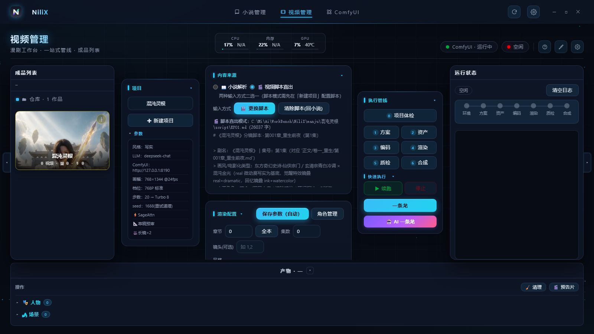
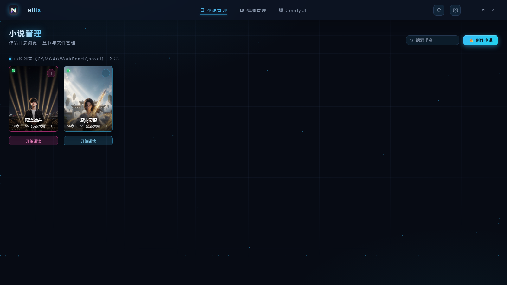
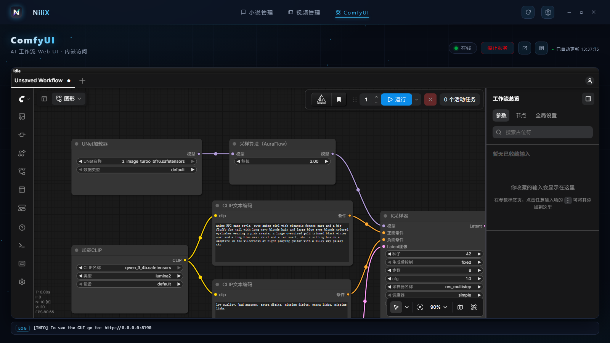

# NiliX

本地 AI 漫剧生产工作台 —— Go 单服务集成：小说管理 + **小说/脚本 → 漫剧全自动流水线**（MiniMax H3 R2V）+ 智能体审片返工 + 系统监测灵动岛。

一台 RTX 5090 Laptop + ComfyUI 即可完成「小说 → 分镜 → 定妆照 → 逐镜视频 → 成片」的全流程，无需打开 ComfyUI 界面。

---

## 界面一览

**视频管理**（桌面主窗口 · 六阶段流水线工作台：项目选择 / 渲染配置 / 执行管线 / 一条龙）



**小说管理**（书架 / 阅读器 / 一键转剧本 / 创作小说）



**ComfyUI 内嵌**（服务管控 / 常驻日志行 / 产物底部面板 / Web UI 内嵌访问）



**灵动岛 HUD**（置顶胶囊 · CPU / 内存 / GPU / 时钟，点按展开系统监测）


## 核心能力

| 模块 | 说明 |
| --- | --- |
| **知识库底座** | `zhishiku` Markdown + 双链解析；小说素材自动利用（人物/场景/设定集/封面五类扫描注入方案生成，日志「📎已利用小说素材」） |
| **小说管理** | 书架浏览、阅读器（全书搜索 / 排版记忆）、一键转剧本、AI 续写（审稿不过自动重写） |
| **视频管理** | 六阶段流水线：方案 → 资产 → 编码 → 渲染 → 质检 → 合成；断点续跑、条件缓存、9 风格预设、8 种画幅；**脚本直出**（新建项目粘贴现成分镜脚本自动启用，免小说拆镜；解析器代数指纹 `script_parse_ver` 版本落后强制重解析，根治坏方案永久复用） |
| **角色资产** | 定妆照 → 角色板（板基于主图 img2img，展示置顶）→ 多视图（含 Q 版）；YuNet 人脸检测中心裁剪（onnx 官方模型 go:embed，兽类自动跳过）；**双形态契约**（「真身提示词：」→ `second_form` → `_form2.png` → 前端「真身·角色名」切换）；盟友/灵宠前缀清理，beast 分流兽形板 |
| **渲染升级** | 分辨率档位（416P 草稿 / 768P 标准 / 1088P 高清）· 草稿预审（审片轮半分辨率→定稿全分辨率零返工）· seed 重试策略 · SageAttention 加速（节点双名探测自动降级）· 渲染检查点崩溃恢复（查 ComfyUI history 免重渲）· 产物时效清单（stale 自动重渲） |
| **云端 2K 定稿** | ☁️ 本地 768×1344/24fps/17k+5 帧产物与 MiniMax `/v2/video_regeneration` 预校验即插即用：本地 GPU 零负担云端升 2K，产物落 `clips/<ep>/2k/` |
| **成片表现** | 转场（硬切/闪黑/叠化，MotionContext 接缝镜自动硬切）· BGM 混音（对白自动闪避 + 风格定向乐器文案）· faststart · 字幕烧录/打码 · 📦 剪映草稿导出（视频+字幕轨可继续编辑，pyJianYingDraft）· 多切点长镜（experimental） |
| **智能体调度** | 🤖 AI 一条龙：剧本师复核 → 审片官逐镜 VLM 判分（八维度对齐 H3 官方能力，判分并发可配）→ 修复师自动改写提示词定点返工 → 终审预算耗尽自动拍板 → 微信升级通知；LLM/VLM token 用量记账；H3 表演层纪律（情绪三层/微表情/哭戏梯度/节奏模型/近景补偿）注入提示词体系 |
| **部署迁移** | 路径全配置化（settings 显式值 → exe 自包含子目录 → 旧硬编码兼容）；**自包含 ComfyUI**（exe 同目录 `comfyui/` 拷贝即迁移）+ 新电脑一键安装（portable 下载/解压/节点/模型清单断点续传）；每日 00:00 自动清理 ComfyUI input/output |
| **界面主题** | galaxy 系 8 套深色银河主题（流金/翠玉/夜紫/朱砂/紫晶/丁香/橄榄/星芒） |
| **系统监测** | 托盘 + 灵动岛悬浮窗（CPU/内存/GPU/磁盘/网络 + ComfyUI/Kb/ZCode/Bot 服务管控）；顶栏监测条（占用·温度·风扇转速） |
| **设备控制** | 🎛️ 雷神控制中心同源硬件通道（逆向 root\wmi ACPIMethod + EC 读写协议）：CPU/GPU 双风扇转速 · 三档性能模式（轻效/进阶/巅峰）· 快速制冷（风扇全速）· 一键超频（NVAPI Pstates20，+200MHz 核心/+1000MHz 显存）；CPU/GPU 核心温度同源读取；EC 通道需管理员令牌，灵动岛「🔒 解锁设备控制」一键提权 |

## 快速开始

```bat
:: 编译(GUI 子系统,无终端黑窗;首次需 go-winres 生成图标资源)
build.bat

:: 启动(默认 8787,托盘常驻)
启动服务.bat
```

打开 `http://127.0.0.1:8787/`（双击 exe 即桌面窗口模式）。开机自启：托盘菜单勾选（写 HKCU Run 键）。

### 依赖

- **Go 1.22+**（`GOPROXY=https://goproxy.cn,direct`）
- **ComfyUI**（端口 8190，由本服务代管启停）：MiniMax H3（FL2VA/Ref2VA）、Z-Image、SDXL 等模型 —— 新电脑可在设置「目录与部署」一键安装，或直接拷贝旧机自包含目录
- **FFmpeg**（合成阶段）
- **DeepSeek API Key**（剧本/方案生成；设置 → 智能体调度）
- **视觉模型**（审片官；推荐智谱 `glm-4.6v-flash` 免费，OpenAI 兼容；429 自动退避降级备模型）
- `lhmsensor/`：LibreHardwareMonitor 温度传感器（可选，缺失自动降级）

## 架构

```
main.go                 入口:工作目录切换 / 看门狗 / HTTP / 灵动岛 / 托盘 / --mainwin 子进程窗口
internal/
  api/                  全部 HTTP 路由(50+ /api/manju/* + 智能体/设置/脚本/fs)
    manju_pipeline.go       六阶段流水线编排
    manju_script_parse.go   脚本直出解析器(代数指纹 script_parse_ver 自愈)
    manju_agent.go          智能体编排:判分/返工闭环/升级/状态落盘
    comfy_selfcontain.go    ComfyUI 自包含部署
    manju_cleanup.go        高级清理(缓存/运行日志)
    scripts/manju_media.py  抽帧/质检/ASR(go:embed 运行时释放)
  agent/                智能体包:vision 客户端 / 审片官 / 修复师 / 维度权重
  render/               ComfyUI 工作流驱动(Z-Image 资产 / H3 T2V / R2V / 角色板)
  storyboard/           小说 → 角色卡/场景卡/镜头表/H3 提示词(DeepSeek)
  backend/              外部服务客户端(ComfyUI /system_stats / LLM)
  assemble/             FFmpeg 合成(concat + loudnorm + faststart)
  verify/               成片机械质检(含段尾冻结检测)
  cleanup/              每日维护:00:00 清空 ComfyUI 共享 input/output
  config/               设置存储(settings.json,AES-GCM 加密 Key)
  kb_work/              知识库解析/双链(纯标准库)
  island/               WebView2 灵动岛窗口(置顶/圆角/透明)
  sysmon/               系统监测采集(gopsutil + nvidia-smi + LHM + 雷神EC/NVAPI 设备控制)
  autostart/ watchdog/  注册表自启 / 单实例互斥体
web/
  kb/                   主页面(小说管理/视频管理/ComfyUI 三页 + 主题/设置)
  island/               灵动岛前端
  index.html            /manage/ 管理页(设置)
third_party/go-webview2 本地补丁(SetTransparent 真透明)
```

## 端口与配置

- **8787**：NiliX 主服务；**8190**：ComfyUI（由本服务代管启停）
- `settings.json`：服务配置（LLM/渲染/路径，AES-GCM 加密 Key，首次运行自动生成）
- `server/settings.json`：漫剧默认 DeepSeek Key（明文，**勿入库**）
- `<项目>/config.json`：每项目渲染配置 + `agent` 节（视觉模型/及格线/返工轮数）
- `<项目>/agent_state.json`：审片报告与升级状态（换集自动清空）

## 关键机制

- **两阶段条件缓存**：条件指纹 = md5(提示词+角色+场景+画幅+帧数)——同条件镜头共享编码；草稿/定稿分辨率各自独立缓存
- **产物时效清单**：`analysis/<ep>_manifest.json` 记录每镜渲染时全部输入指纹（含资产指纹、定妆照 mtime、视图代数 views_gen），current/stale/missing 四态——换定妆照/改提示词后旧产物自动标 stale 并删旧重渲（含条件缓存，隐性失效防线）
- **渲染检查点**：ComfyUI prompt_id 提交即落盘，崩溃/重启后续跑先查 history 收回已完成任务（绝不重复烧 GPU）；白名单含 `all`，断电重启自动续跑
- **解析器代数指纹**：`script_parse_ver` 随解析器升级强制重解析旧产物——程序化优先、LLM 兜底的结构必须带版本自愈，杜绝「解析失败静默回退 LLM 直出后坏方案永久复用」
- **脚本机械质检**：scriptValidateShots 校验时间戳递增/时长分布/台词与六段式同步，旁白预算（chars_per_sec 可配）超限自动补偿 clamp
- **审片八维度**：主体 20 / 场景 12 / 动作 15 / 运镜 10 / 可见性 15(近黑防线) / 技术 15 / 风格 8 / 口型 5，加权分 Go 侧计算不信任模型自报
- **断点续跑**：全阶段幂等，`▶ 续跑` 从断点继续；H3 输出仅首帧 IDR，剪辑必须重编码
- **静态资源版本化**：HTML `no-cache` + 资产 `?v=` 参数，改前端必须 bump 版本号

## 官方参数基线

768×1344(9:16) / 20 步（Turbo LoRA 8 步 ≈ 2.9× 提速）/ seed 全剧固定 / 时长 4-15s（min/max_shot_seconds 可配，超预算自动补偿）/ `<d>中文</d>` 原生对白（多重配音 MotionContext 尾音 pin，audio_context_length 可配）。

拆镜密度 11-17 镜/章，单镜 ≤3 角色、台词 ≤20 字；节奏模型（5s≈3-4 拍 / 10s≈5-7 拍 / 15s≈6-9 拍 + 峰值刹车），情感戏强制近景特写。

## License

私有项目，仅限本机使用。
